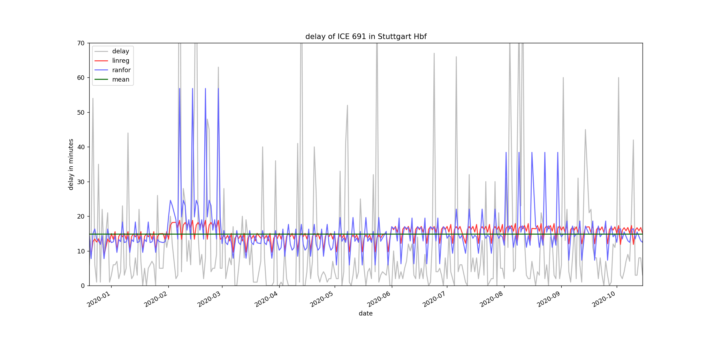
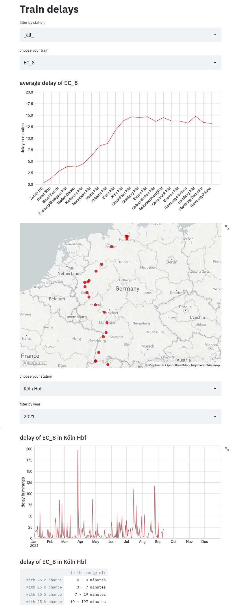

# Train delay predictor

With this project I tried to predict the delay of trains for each station. My assumption was to consider the trains and stations individually and to find patterns to train the machine learning on. I created a python streamlit website to display the delay information. A prediction is given by the statistic.

## Get the Data

I scrape the data using `selenium` from [zugfinder.net](https://www.zugfinder.net/de/start), a private site that scrapes the data from the traveler information of the train operators.

## Model

From `scikit/learn` I compared:

* `DummyRegressor`
* `LinearRegression` with month/weekdays as features
* `RandomForestRegressor` with month/weekdays as features

The delays don't follow clear trends and the linear and random forest models have hard time to improve the prediction compared to the DummyClassifier (average delay) essentially.

## Streamlit website

To run the website: `streamlit run my_delay_app.py`

## Acknowledgement

This project was part [Spiced Academy](https://www.spiced-academy.com/en) Data Science course. Thanks to all!
